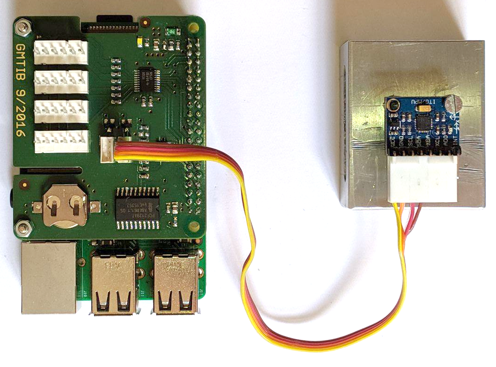
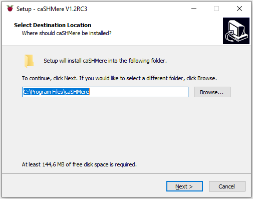

==========
Quickstart
==========

Requirements
------------

To start using the RasPyre platform, you need the following:

- 1 or more Raspberry Pi Model 3B+ (including power source)
- an SD card with a minimum of 4GB capacity per Raspberry Pi
- at least one USB WiFi adapter using a Ralink RT5370 chip
- 1 or more MPU6050 Accelerometer (mounted on a breakout board, including wiring)

Software Setup (Raspberry Pi)
-----------------------------

For easier installation you can obtain an SD card image based on the Raspbian operating system from
`<https://github.com/msk-buw/raspyre/releases>`_
The image is preconfigured with a Linux Real Time Kernel and the RasPyre driver module for MPU6050 accelerometers.

Download the file ``raspyre_sdcard_image.zip`` to your computer and unpack the ZIP archive.

Write the resulting image file ``raspyre_sdcard_image.img`` to each SD card.

.. note:: 

   If you need help with the process, refer to the system-specific guides from the Raspberry Pi foundation:

   - `Linux <https://www.raspberrypi.org/documentation/installation/installing-images/linux.md>`_
   - `Mac OS <https://www.raspberrypi.org/documentation/installation/installing-images/mac.md>`_
   - `Windows <https://www.raspberrypi.org/documentation/installation/installing-images/windows.md>`_

For manual installation and configuration of the RasPyre components: see section `Manual Installation`.

Hardware Setup
--------------

Connect each MPU6050 accelerometer to each Raspberry Pi, that you wish to utilize as a sensor node, according to :numref:`mpu6050wiring`.

If you are using the Connector PiHat, connect the sensor with an 8pin Molex to 4pin JST-ZH-1.50mm cable as shown in :numref:`mpu6050wiringhat`.

.. _mpu6050wiring:
.. figure:: images/mpu6050_wiring.png
   :alt: Wiring diagram of the connection between the Raspberry Pi and an MPU6050 breakout board
   :width: 500px

   Wiring diagram of the connection between the Raspberry Pi and an MPU6050 breakout board.

.. _mpu6050wiringhat:

   Connection between the Raspberry Pi and an MPU6050 sensor with an 8pin Molex to 4pin JST-ZH-1.50mm cable.

Software Setup (caSHMmere frontend)
-----------------------------------

Windows
^^^^^^^

Download the latest ``cashmere_frontend_win_setup.exe`` from `<https://github.com/msk-buw/raspyre/releases/>`_.
Run the setup wizard and install **caSHMere** to a location of your choice (:numref:`windowssetup`). Finally, start **caSHMere** from the desktop link or from the start menu entry.

.. _windowssetup:

   Windows setup wizard to install **caSHMere**.

Linux
^^^^^

Download the latest ``cashmere_frontend_linux.tar.gz`` from  `<https://github.com/msk-buw/raspyre/releases/>`_.
Extract the archive from the command line and run the extracted ``cashmere`` binary file.

.. code-block:: bash

   tar xfz cashmere_frontend_linux.tar.gz
   cd cashmere
   ./cashmere
   
MacOS
^^^^^

Download the latest ``cashmere_frontend_macos.dmg`` from  `<https://github.com/msk-buw/raspyre/releases/>`_.
Mount the DMG and double click on ``caSHMere.app`` or drag and drop the program into your Applications folder in Finder.

First Steps
-----------

Setting up the sensor network
^^^^^^^^^^^^^^^^^^^^^^^^^^^^^

   Setup the raspyre nodes and supply each with a power source.
   Choose a portal node that can be reached via WiFi by plugging in the USB network adapter into a free USB port.
   Note: You can change the portal node at will by unplugging the USB network adapter and plugging it into a different node.

Network mesh
^^^^^^^^^^^^
   
   Allow ~30 seconds for the system to set up its network configuration correctly and for the nodes in the mesh network to exchange routing information.
   Connect your local machine to the open WiFi access point named **“RaspyreAP”**

Frontend software
^^^^^^^^^^^^^^^^^

   Start up **caSHMere**. You will be greeted by a splash screen and the main interface is visible (:numref:`mainwindow`).

   .. _mainwindow:
   .. figure:: images/screen_main.JPG
       :alt: caSHMere main interface after startup.

       **caSHMere** main interface after startup.

   The main interface is composed of three widgets.
   On the left is the central control widget to discover nodes in the sensor network and to send commands to individual nodes or groups of nodes.
   The right widget is dedicated to different widgets to visualize received sensor signals. The bottom area displays logging output during the runtime.

   .. note::
      **caSHMere** needs full network permissions to run properly. On Windows you should allow network access when you are presented the firewall prompt (:numref:`windowsfirewall`).

   .. _windowsfirewall:
   .. figure:: images/windows_firewall.png

      Windows firewall prompt to allow network access of the application.

Node discovery
^^^^^^^^^^^^^^
 
   Nodes are automatically discovered when you are connected to a portal node. Portal nodes are indicated in the list of nodes by a WiFi-signal icon.

   Click “Refresh node list” to query the portal node for the routing information of the nodes in the sensor network. 
   The list in the upper left corner should then be populated with reachable nodes and its IP addresses.

   .. note::
      Please allow up to 2 minutes for the routing information to be correct if you introduce additional nodes to the network during runtime.

Sending commands
^^^^^^^^^^^^^^^^

   To send commands to individual nodes select a node from the list by left clicking. Activate the context menu by right clicking. From there you can choose different commands to send to the selected nodes.
   You can select several nodes as a group by holding down the Shift key. Individual nodes can be added to a selection group by holding down the Ctrl key while left clicking.

Time synchronization
^^^^^^^^^^^^^^^^^^^^

   To synchronize the time between the nodes in the mesh network you can individually assign a node the role of the master node and configure the remaining nodes to synchronize relative to this master node.
   A shortcut for this configuration task has been added to the interface.
   By selecting ``Set reference time`` in the context menu, the program tries to set the portal node as a master node and configure the the remaining nodes to use this server for synchronization. The reference time synchronization node is indicated in the node widget list with a clock icon (:numref:`timesync`).

   .. _timesync:
   .. figure:: images/screen_timesync.JPG
      :width: 350px

      Node list widget displaying node ``rp-node-ceauk`` as reference time node.

   The logging widget provides additional information about the sent commands.

   Note: Please allow ~2 minutes for the network to synchronize completely. You can visually inspect the synchronization by sending the command ``Toggle blinking``. The selected nodes should blink synchronously after some time.

Configuration of attached sensor hardware
^^^^^^^^^^^^^^^^^^^^^^^^^^^^^^^^^^^^^^^^^
  
   The configuration of installed sensor hardware is performed via the context menu as well. Select the nodes you wish to configure and select ``Measurement Control/Add sensor`` from the context menu.
   A dialog window will appear. Please refer to the individual module documentations for the details of configuration (:numref:`addsensor`)
   
   .. _addsensor:
   .. figure:: images/screen_add_sensor.JPG

      Sensor configuration dialog to add a new ``MPU6050`` sensor instance.
   
   The dialog is pre-filled with a default configuration for the MPU6050 sensor.
   
   * The name field can be freely chosen for later easier identification of the generated time series records.
   * The sensor type selects the installed driver module to use for the specific sensor hardware.
   * The configuration field is a serialized JSON string holding the individual sensor parameters. Please refer to the documentation of the sensor module. For the MPU6050 sensor, the only configurable parameter is the address of the I2C cable. You can either select address 0x68 or 0x69 according to the connected cable.
   * The frequency field defines the polling frequency for the specified sensor task.
   * The channels field consists of a list of channel identifiers which are to be polled during the measurement. Please refer to the documentation of the sensor module for a list of valid channels. For the MPU6050 sensor, the acceleration axes are already selected, denoted by “accx”, “accy”, “accz”.

   The newly added sensor will be indicated in the node widget list, below the selected RasPyre node and indicated with a red icon to show that it is not currently measuring (:numref:`configuredsensor`).

   .. _configuredsensor:
   .. figure:: images/screen_configured_sensor.JPG
      :width: 350px

      Configured sensor below the RasPyre node it is attached to.

Start and stop a measurement
^^^^^^^^^^^^^^^^^^^^^^^^^^^^
      
   To start a measurement select nodes which are properly configured for their sensor hardware and select in the context menu 
   ``Measurement control/Start measurement``. You will be prompted to provide a name for the measurement (:numref:`startmeasurement`). The nodes will start the measurement task and record time series on their local storage. Additionally the sensor signal is published on a network socket.

   The node list widget indicates a running measurement with a green light icon next to the configured sensor (:numref:`measuring`).

   .. _startmeasurement:
   .. figure:: images/screen_start_measurement.JPG

      Dialog to start a measurement for the selected nodes.

   .. _measuring:
   .. figure:: images/screen_measuring.JPG
      :width: 350px

      Sensor node indicator for a running measurement.
   
   To stop a measurement select ``Measurement control/Stop measurement`` from the context menu of your selected nodes.

Transfer recorded time series data
^^^^^^^^^^^^^^^^^^^^^^^^^^^^^^^^^^

   To download recorded time series from individual nodes select ``File Manager`` from the context menu. The node will be queried for its recorded measurement files and they will be displayed in the list of the dialog (:numref:`filetransfer`).

   .. _filetransfer:
   .. figure:: images/screen_filetransfer.JPG

      File transfer dialog showing the stored measurement files on the RasPyre node.

   Select the file you wish to transfer and click the Download button.
   Select the destination where you wish to save the downloaded time series file. If the checkbox “Convert to CSV” is ticked, the transferred binary file will automatically converted to a CSV file. The original binary will be deleted after successful conversion.
   
   Each time series file is named after the following scheme:
   ``hostname__measurementname_sensorname_timestamp.bin``

Plot signal during measurement
^^^^^^^^^^^^^^^^^^^^^^^^^^^^^^

    During a running measurement the acquired signal data can by visualized live by utilizing the plot widgets.
   
    Click the button labeled ``Create plot widget``. A dialog will appear to configure to which signal to subscribe.
    
    The fields a pre-filled with default information for the case you wish to subscribe to a signal from a MPU6050 sensor (:numref:`plot1`).
    
    .. _plot1:
    .. figure:: images/cashmere_plot1.png
       :width: 400px

       Plot creation dialog.
    
    * The Address field denotes the ZMQ-network address to which you wish to subscribe.
      Each measurement publishes its signal on the port 5556.
      Enter the information in the following form:
      ``tcp://IP_ADDRESS:5556``
    * The channels field consists of a list of the channels in the acquired network packets. Please refer to the documentation of the individual sensor module for specifics.
    * The datatypes field string denotes the datatypes of the channels. In the given example, the individual channels are decoded as double datatype.
    * The units field consists of a list of the units for each individual channel. In the example, the time channel is interpreted as a 64bit datetime timestamp. 
    
    After successful time synchronization and configuration a new plot widget will appear in the right area of the interface (:numref:`plot2`).
    
    .. _plot2:
    .. figure:: images/cashmere_plot2.png

       Newly created plot widget in MDI area.
    
    By grabbing the right edge of the plot window with the left mouse button, you can drag the FFT plotting area into the plot.
    Tick the checkbox ``Calculate FFT`` to calculate a Fast Fourier Transform for the selected signal and visualize it (:numref:`plot3`)
    
    You can utilize the left mouse button in the plot window to drag the signal along the axes and the right mouse button to adjust the scaling of the plot area. If you wish to stop plotting the signal just close the sub window inside the right area of the interface.
    
    .. _plot3:
    .. figure:: images/cashmere_plot3.png

       Plot widget displaying additional FFT plot.

